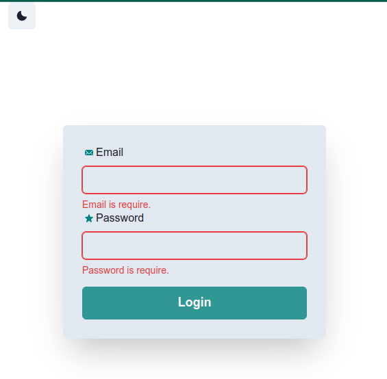
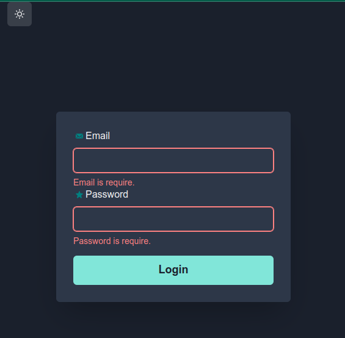

# Estudando ViteJs com Chakra UI

|  |  |
| --- | --- |

## Contexto

Aprendendo a Usar Vite e Chakra Ui

## Técnologias usadas

Front-end:
> Desenvolvido usando: React, Chakra UI

<!-- Back-end:
> Desenvolvido usando: NodeJS, ExpressJS, MongoDB, MYSQL, ES6 -->

## Instalando Dependências

* clone o projeto:

 ```bash
 git clone git@github.com:Andreyrvs/Vite-React-Chakra-UI.git
 ```

<!-- > Backend

  ```bash
    cd api/ 
    npm install
  ``` -->

> Frontend

  ```bash
    cd Vite-React-Chakra-UI
    npm install
  ```

## Executando aplicação

<!-- * Para rodar o back-end:

  ```bash
  cd api/ && npm start
  ``` -->

* Para rodar o front-end:

```bash
  npm run dev
```

<!-- ## Executando Testes

* Para rodar todos os testes:

  ```bash
    npm test
  ``` -->
